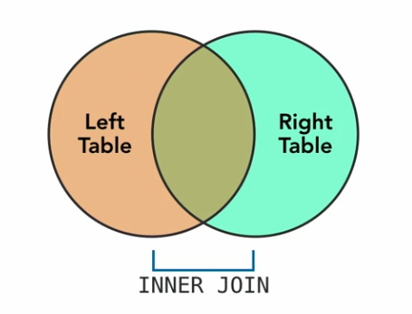
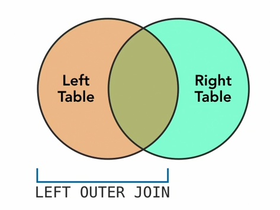
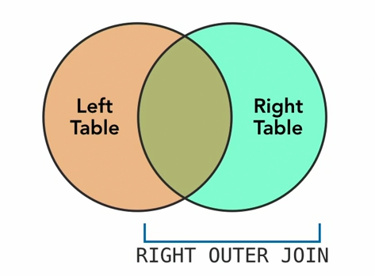
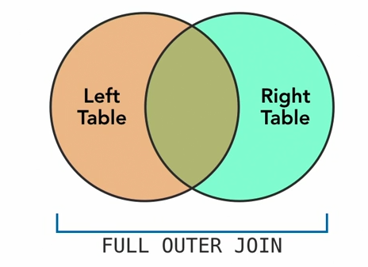

# 4. Relationships
Tables often contain information related to another tables. You can perform operations across tables using `JOIN`

## 4.1 JOIN fundamentals
- Inner join: default. Includes rows from both tables where the `JOIN` condition is met.

- Outer join: 
    - left outer join: rows where the condition is met + all the rows from the table on the left where condition is not met <br> 
    - right outer join: similar to above. Can be rewritten as a left outer join by swapping the order <br> 
    - full outer join: combines left and right joins <br> 

## 4.2 JOIN statements 
- join example tables, left and right
```sql
-- test.db
CREATE TABLE left ( id INTEGER, description TEXT );
CREATE TABLE right ( id INTEGER, description TEXT );
--
INSERT INTO left VALUES ( 1, 'left 01' );
INSERT INTO left VALUES ( 2, 'left 02' );
INSERT INTO left VALUES ( 3, 'left 03' );
INSERT INTO left VALUES ( 4, 'left 04' );
INSERT INTO left VALUES ( 5, 'left 05' );
INSERT INTO left VALUES ( 6, 'left 06' );
INSERT INTO left VALUES ( 7, 'left 07' );
INSERT INTO left VALUES ( 8, 'left 08' );
INSERT INTO left VALUES ( 9, 'left 09' );
--
INSERT INTO right VALUES ( 6, 'right 06' );
INSERT INTO right VALUES ( 7, 'right 07' );
INSERT INTO right VALUES ( 8, 'right 08' );
INSERT INTO right VALUES ( 9, 'right 09' );
INSERT INTO right VALUES ( 10, 'right 10' );
INSERT INTO right VALUES ( 11, 'right 11' );
INSERT INTO right VALUES ( 11, 'right 12' );
INSERT INTO right VALUES ( 11, 'right 13' );
INSERT INTO right VALUES ( 11, 'right 14' );
--
SELECT * FROM left;
SELECT * FROM right;
--
SELECT l.description AS left, r.description AS right
  FROM left AS l
  JOIN right AS r ON l.id = r.id
  ;
```
- The `JOIN` query. Inner join where the left and right IDs match, show their descriptions. In the first line, you provide alias for the two columns since they have the same column
- to do left outer join, `LEFT JOIN right AS r ON l.id = r.id`
---
- restore database
  ```sql
  DROP TABLE left;
  DROP TABLE right;
  ```
---
- sale example
  ```sql
  SELECT * FROM sale;
  SELECT * FROM item;
  --
  SELECT s.id AS sale, i.name, s.price 
    FROM sale AS s
    JOIN item AS i ON s.item_id = i.id
    ;
  ```
  - slightly better example. Obtain sale ID, name of item and price from two different tables (sale and item)
---
- another example
  ```sql
  SELECT s.id AS sale, s.date, i.name, i.description, s.price 
    FROM sale AS s
    JOIN item AS i ON s.item_id = i.id
    ;
  ```

## 4.3 Junction
In practice, tables have many-to-many relationships.

```sql
-- test.db
SELECT c.name AS Cust, c.zip, i.name AS Item, i.description, s.quantity AS Quan, s.price AS Price
  FROM sale AS s
  JOIN item AS i ON s.item_id = i.id
  JOIN customer AS c ON s.customer_id = c.id
  ORDER BY Cust, Item
;
```
- combines cutomer, sale and item tables
- these can be ordered as well
---
- What if you want your table to include a customer without sales?
  ```sql
  INSERT INTO customer ( name ) VALUES ( 'Jane Smith' );
  SELECT * FROM customer;`
  ```
- Use left join to join other tables _with Customer_.
  ```sql
  SELECT c.name AS Cust, c.zip, i.name AS Item, i.description, s.quantity AS Quan, s.price AS Price
    FROM customer AS c
    LEFT JOIN sale AS s ON s.customer_id = c.id
    LEFT JOIN item AS i ON s.item_id = i.id
    ORDER BY Cust, Item
  ;
  ```
- This is amazing. It adds multiple sale entries for customers in separate rows.